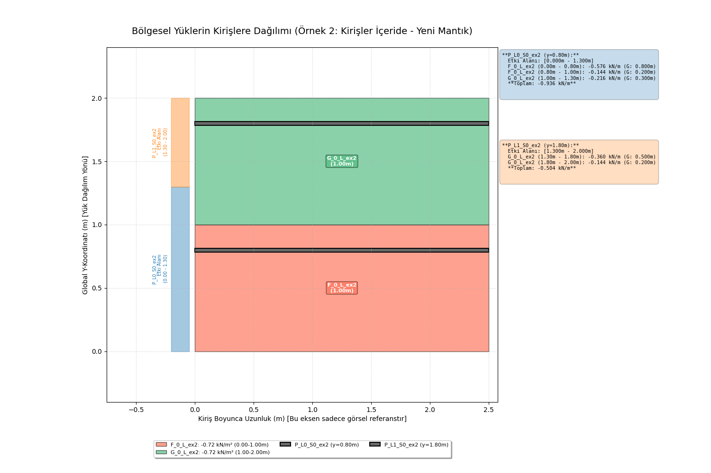

# Bölgesel Yük Dağılım Hesaplayıcı ve Görselleştirici

Bu proje, basit bir yapısal senaryoda iki bitişik bölgesel yükün (alan yükü) iki paralel kirişe nasıl dağıtıldığını hesaplayan ve bu dağılımı 2B olarak görselleştiren bir Python uygulamasıdır.

Proje, nesne tabanlı programlama prensipleri kullanılarak yapılandırılmıştır ve hesaplama, raporlama ve görselleştirme aşamalarını ayrı sınıflar halinde düzenler. Bu, kodun okunabilirliğini, sürdürülebilirliğini ve genişletilebilirliğini artırmayı hedefler.



## Özellikler

*   İki bitişik dikdörtgen bölgesel yük tanımı (yoğunluk, genişlik, uzunluk).
*   Yük alanının dış kenarlarında yer alan iki paralel kiriş tanımı.
*   Her bir kirişe aktarılan yayılı yüklerin (kN/m cinsinden) hesaplanması.
*   Hesaplama mantığı: Kirişlerin, aralarındaki toplam yük genişliğini eşit olarak paylaştığı varsayılır (her kiriş toplam genişliğin yarısı kadar bir etki alanına sahiptir).
*   Hesaplama sonuçlarının konsola raporlanması.
*   `matplotlib` kütüphanesi kullanılarak yüklerin, kirişlerin ve yük paylaşım sınırının 2B olarak görselleştirilmesi.
*   Etki alanlarının ve hesaplanan yayılı yük değerlerinin grafik üzerinde gösterimi.

## Kullanılan Teknolojiler

*   Python 3.x
*   Matplotlib (Görselleştirme için)

## Kurulum

1.  Projeyi klonlayın veya indirin:
    ```bash
    git clone https://github.com/kullanici_adiniz/proje_adiniz.git
    cd proje_adiniz
    ```
2.  Gerekli Python kütüphanesini yükleyin (eğer yüklü değilse):
    ```bash
    pip install matplotlib
    ```

## Kullanım

Ana betik dosyasını (örneğin `load_distributor.py` veya kodunuzun bulunduğu dosyanın adı) Python ile çalıştırın:

```bash
python load_distributor.py


